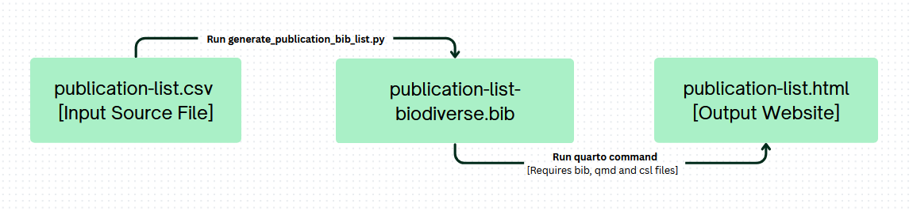

# Publication Website Link

https://biogeospatial.github.io/Biodiverse_publication_list/

# publist

This repository contains various scripts to produce a publication list from a csv file.

Biodiverse publication Workflow (Visualisation of CICD, also can be replicated locally if required. Instructions down further below):



The csv file `publication-list.csv` is the source of where the DOIs come from. If this is changed, a script `generate_publication_bib_list.py` is automatically run to produce a `publication-list-biodiverse.bib` file. This script is derived from the `publist-wrangle.ipynb` notebook file. The notebook uses the `bibtexparser` library to parse the `publication-list.csv` to create the .bib file.

After this, quarto is run to produce a html file. Github expects a folder to publish from (`site/` in this case). This is why in the yml file, it creates a `site/` folder and moves the html to that folder.

Note: May need to rewrite the steps in the **dependencies** section this as it may be outdated. Though steps 2-5 seem to explain the process behind quarto.

# Important information

### Updating the csv file `publication-list.csv`:

To add new DOIs, just add it as a new line entry into the `publication-list.csv` file. It does not matter what order you add the entry to in the file (Quarto uses Pandoc under the hood to handle citations and bibliography), as long as each DOI entry is on its own line.

#### Column Order:

The CSV file must follow this exact column order:
`doi,author,editor,isbn,issn,journal,note,number,pages,publisher,title,url,volume,year`
It is important you follow this order, where each value is separated by a comma (,).

#### Missing Values:

If a DOI (or any entry) does not have a value for a particular column, leave that column empty. For example:

`10.1234/abc,,,"",,Journal Name,,1,10-20,Publisher,Title,http://example.com,5,2025`

The empty columns are represented by consecutive commas.

#### Handling Commas in Entries:

If a value itself contains a comma, enclose it in double quotation marks. For example:

`10.1234/abc,"Smith, John",,123456789,,Journal Name,,1,10-20,Publisher,Title,http://example.com,5,2025`

#### Signifying a DOI as either a "in press" or "preprint" option

The csv file has a column named note. Add either option to this column.

### What happens if CICD Automation fails

There is two options to this:

#### 1. Manually triggering CICD

The `render-publications.yml` workflow has included: `workflow_dispatch: {}`. This allows you to manually trigger the workflow button in the Actions tab anytime you want without commiting anything.

#### 2. Running Locally

Running it locally should always work. Make sure you have the following prerequisites files:

```
- "publication-list.csv"
- "generate_publication_bib_list.py"
- "publication-list.qmd"
- "global-ecology-and-biogeography.csl"
```

Make sure correct dependencies are installed:

```
Sudo apt install python3-pip

pip install mistune pandas bibtexparser requests
```

Then run:

```
python3 generate_publication_bib_list.py
```

to generate the `publication-list-biodiverse.bib` bib file.

Then:

```
quarto render publication-list.qmd --to html
```

to create the `publication-list.html` html file. You should then be able to view this file as intended.

## Dependencies

- Python 3.8+
- Quarto
- pandoc

The workflow for future publications repository is as follows:

1. Manually update the publication-list-biodiverse.bib, this does not need to be in any specific order. This step can also be automated in the future. Issue #2

2. Using the `publication-list.qmd`, we can generate a .html of publication list. Behind the scenes, Quarto uses pandoc to convert the .qmd file to .html.

3. The `publication-list.qmd` file uses the `publication-list-biodiverse.bib` file to generate the publication list. The .qmd file is a Quarto document that uses the `pandoc-csl` filter to format the bibliography using a citation style language (CSL) file. The CSL used here is based on the Global Ecology and Biogeography (GEB) journal style with some modifications.

4. The .csl contains modications to print out "(in press)" or "(preprint)" after the year for each reference. This are commented inside the .csl within the <bibliography> tag.

5. The .csl will also group references first by "in press" and then by "preprint". This is done by using the `sort` tag in the .csl file. The `sort` tag is set to "in press" and "preprint" to group the references accordingly

## Room for improvement

It is possible to create a header for "In Press", "Preprints", "Published" using a .lua filter. Lua filters can be called within the Quarto doc using the `filters:` field in the yaml header.

I've tried my best to implement this but with no luck. The actua lua filter is in `groupbib/_extensions/filters/groupbib.lua`

This filter was created following [Quarto's documentation](https://quarto.org/docs/extensions/filters.html#filter-extensions).
